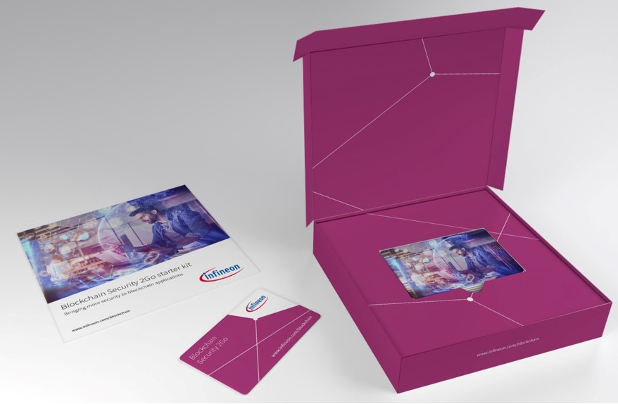
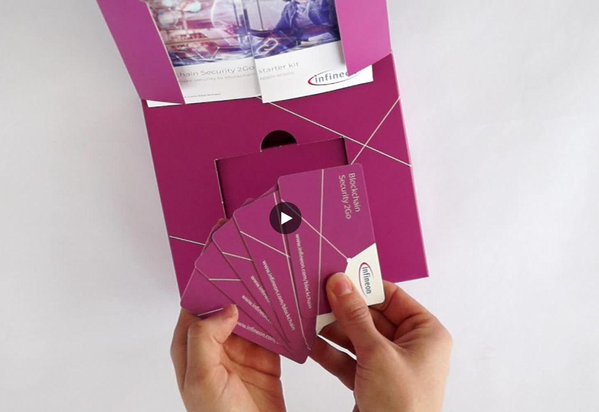

# Infineon's Blockchain Security 2Go Starter Kit

This repository provides all you need to work with [Infineon's](https://www.infineon.com "Infineon's Homepage") [Blockchain Security 2Go Starterkit](https://www.infineon.com/blockchain). 

Infineon’s Blockchain Security 2Go starter kit provides protection of user credentials (keys) with a security controller offering security on a high level. It gives you a fast and easy way to build hardware-based security in your blockchain system design. 

<!-- If you don't have the starter kit yet, you can order it [here](https://providelinkhere.com). -->

High-level information about the Starterkit is available at [infineon.com/blockchain](https://www.infineon.com/blockchain). 

If you have technical questions or you want to see a new feature of the starter kit please create an issue.

## Table of Content
  * [Getting Started](#getting-started)
  * [Develop your Own Blockchain Security 2Go Application](#develop-your-own-blockchain-security-2go-application)
  * [FAQs](#faqs)
  * [Contributing](#contributing)
  
## Getting Started
To link the Blockchain Security 2Go smart cards to a Blockchain, you need a device that handles the communication with the Blockchain. This could either be
* an NFC-enabled smartphone, or
* a host device (e.g. PC, RasperryPi) connected to a contactless reader. 

### Getting Started with an Android Smart Phone
Try out your cards with the example android app developed by [coinfinity](https://coinfinity.co/about/) that is available on [PlayStore](https://play.google.com/store/apps/details?id=co.coinfinity.infineonandroidapp):

The [Android Demo User Guide](android/Android_Demo_UserGuide.pdf) provides more details on how to use the app. Have a look at the hands-on video to see how to prepare the cards for usage with the App: https://e.video-cdn.net/video?video-id=7k2xBuhwB8Xsv3C9s6oyJv&player-id=E9W5foaMoUuxrto5-fGaPP

The source code is available as open source at https://github.com/Infineon/BlockchainSecurity2Go-Android.

### Getting Started with Windows, Linux and Mac
The BlockSec2Go Python library gives you an easy way to use your cards with an Windows, Linux, or Mac device. Follow the steps of the getting started guide at the https://github.com/Infineon/BlockchainSecurity2Go-Python-Library. 

The [Praesidium](https://github.com/DhruvKhemani/Praesidium) application is a full bitcoin wallet that offers almost all functionalities of the card in a fast and intuitive GUI. It also serves as the prime example for the Blocksec2Go library.

Praesidium is completely open source and is avaliable [here](https://github.com/DhruvKhemani/Praesidium).

## Develop your Own Blockchain Security 2Go Application
To develop your own Blockchain Security 2Go Application first read the [Blockchain Security 2Go User Manual](doc/BlockchainSecurity2Go_UserManual.pdf). It contains a description of all commands that are supported as well as an introduction of how to integrate them in a Blockchain application.  

To create an own Blockchain Security 2Go application you basically need two things:
* a Blockchain network as your underlaying background technology, and
* an interface to integrate the Blockchain Security 2Go cards in that Blockchain. 

To link the Blockchain Security 2Go starter kit to the chosen Blockchain, you need some interface device (e.g. NFC-enabled smartphone or a host device such as a PC, or embedded device equiped with a contactless reader). The main business logic of your application can be reallized in a software application that runs on such an interface device and, optionally, a smart-contract deployed on your chosen Blockchain. 

When starting to realize your own idea
* read the [Blockchain Security 2Go User Manual](doc/BlockchainSecurity2Go_UserManual.pdf) (It contains an API description, as well as an introduction of how to integrate it in a Blockchain-based system) and either have a look at 
* the [Coinfinity Reference Android App](#android-application), or
* the [supporting libraries for PC-like systems (Windows, Linux or Mac)](pc)

If you want some inspiration to get an idea how to use the Blockchain Security 2Go starter kit have a look at the existing [application examples](doc/known_applications.md) or just pick an idea listed in the [new application ideas list](doc/new_application_ideas.md). 

### Android Application
The example app demonstrates the use of the Blockchain Security 2Go starter kit in NFC-enabled Android phones. The source code is open source and available at https://github.com/Infineon/BlockchainSecurity2Go-Android. 

The application demonstrates
* sending and receiving Ethereum tokens (ETH),
* sending and receiving ERC-20 tokens, and
* interacting with an example smart contract deployed on the Ethereum blockchain (examplified with a voting demonstration). 

More information is available in the [android folder](android). 

 
### Windows, Linux, or Mac Application
For PC platforms you need a contactless reader. We recommand a USB reader listed at [ccid.apdu.fr](https://ccid.apdu.fr/select_readers/?features=contactless). The Blockchain Security 2Go smart cards are tested with the Identive Cloud 4700 F reader. 

A fast way to start is to use the Blockchain Security 2Go Python library. It includes a command line tool as well as an easy-to-use python library. A getting started guide for the library as well as the source code is available at the
https://github.com/Infineon/BlockchainSecurity2Go-Python-Library. 

If you want to use another language have a look at the [MUSCLE libary](https://github.com/LudovicRousseau/PCSC). 

More information is available in the [pc folder](pc).

## Unboxing video

https://e.video-cdn.net/video?video-id=7k2xBuhwB8Xsv3C9s6oyJv&player-id=E9W5foaMoUuxrto5-fGaPP

## FAQs
### Which Blockchains are supported by the Blockchain Security 2Go starter kit?
The Blockchain Security 2Go starter kit supports the majority of todays existing Blockchains. More specifically, all blockchains that authenticate a transaction with Elliptic Curve Cryptography (ECC) based on the 'secp256k1' curve. For example, this applies to [Bitcoin](https://bitcoin.org), [Ethereum](https://www.ethereum.org/) and ERC20 tokens such as [Streamr](https://www.streamr.com/). This means for your Blockchain Security 2Go application, you can either choose such an existing Blockchain that fits your needs, or you could even create a new one. 

Systems that do not use traditional asymmetric cryptography such as IOTA are not supported.

### What happens if I lose a Blockchain Security 2Go card?
If PIN authentication is enabled, it could prevent that somebdoy else uses your card without knowing the PIN. If you have no backup, you have no access to the assets that correspond to the keys on the card. To prevent this you could generate backups as described in the [User Manual](doc/BlockchainSecurity2Go_UserManual.pdf).

### I want another form factor or interface, what should I do?
Please directly contact the customer support of Infineon Technologies AG. They will be glad to support you.

## Contributing
For reporting technical issues or proposing new features, please create a new issue. 

Read more in the [contributing guide](CONTRIBUTING.md).
