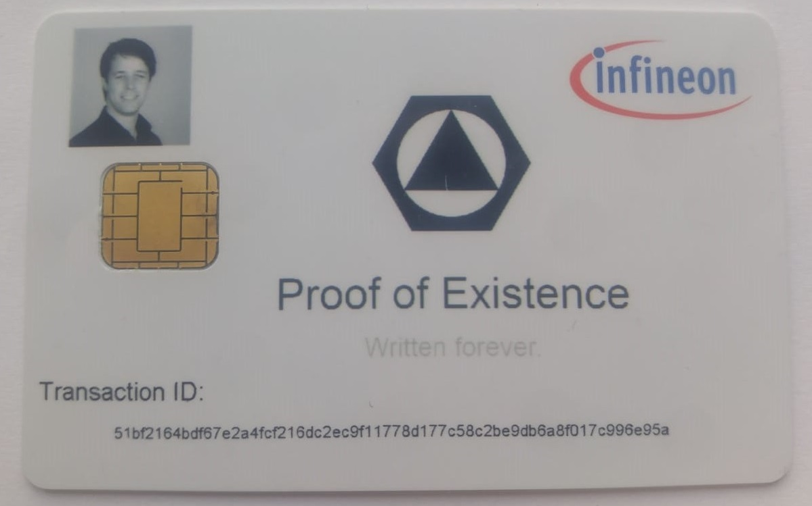

# Hackathon 2019

## Document certification - Proof of existence
Due to the Blockchain technology there are more and more virtual notary services available: https://proofofexistence.com/, https://stampery.com/, https://poex.io/, https://chainy.info/… With these services you are able to write data (e.g. a hash of a document) to the blockchain. The private key that was used to generate the transaction message allows you to proof the ownership, the existence but also the integrity of any kind of data without relying on trusted third parties. The service is also often used to proof that a specific recipient read your email at a certain point in time. A physical token, representing ownership of the data, maybe embedded in a real contract etc., does make sense.

Within this example the service "proofofexistence" for bitcoin was used to generate a transaction with the DOCPROOF attribute for the bitcoin network: https://www.blockchain.com/btc/tx/51bf2164bdf67e2a4fcf216dc2ec9f11778d177c58c2be9db6a8f017c996e95a

## BeerDentity
Blockchain identity verification using zero knowledge proofs: https://github.com/rekt0x/infineon_hackathon_2019
Usecase: The Infineon's Blockchain Security 2Go Starter Kit is used to store identity tokens using zero knowledge proofs in order to perform age verification without revealing any personal data. An user needs to go to a local authority with his hardware wallet smart card. The authority created a proof that the person is older than 18 years and issues an Identity Token to the users wallet. The user can then use the hardware wallet smart card at various locations to proof he is old enough to use certain services without revealing his real age or birthday to the 3rd party.

## Physical representation of "Cryptokitties"
With this project a physical form of the Ethereum based Cryptokitties was generated. Therefore key1 of the card was read out and converted to an Ethereum address. After that, 6 Kitties were bought at the market and transferred to the prepared and printed card. All transfers can be checked at etherscan.io.

Daniela Fuzzyhands: https://etherscan.io/tx/0x39d8119652aaaa48980b0c36ad7294d933ad16ea64ab774e3f955f18f5db7bf4  
Fabiano Lilsmoochie: https://etherscan.io/tx/0xa12fda9f27aa3e211dca80dfc07d3048cd4b22202ae3994d303955fe120ee522  
Pepper Magicwump: https://etherscan.io/tx/0x396c2735c57e3526db052f2a4239ee7d58b2d97ecedfaf045a9d8d89585be762  
Tundra Sister: https://etherscan.io/tx/0x65e4685a53efa804e976547b83abc1fe97b572c149dfa0dab03f2a297450dbf4  
Lulu Scootchrum: https://etherscan.io/tx/0x147dcc8b343e7476a801bfac86337c5b7c34e9c968e532907cf944073d269a65  
Moses Alldub: https://etherscan.io/tx/0x382532902ccf948738a2ca9e6c5c3d4e47c881d1e797855aa400ad3259750b47  

## Streaming: "Ka Göd, ka Musi"

## Guardian Card

## Bitcoin Bounty Vendingmachine

  

