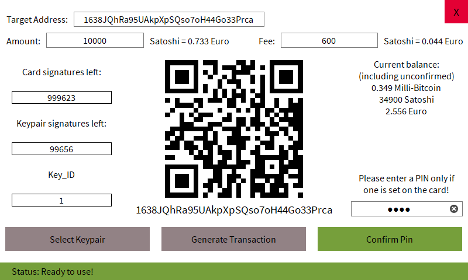

# Blockchain Security 2Go Starter Kit for PC Platforms

## Contactless Reader
In a Windows, Linux, or Mac environment you need some way to communicate to the contactless smart card. We recommend to use a reader that is connected via USB to the host device (a list is available at [ccid.apdu.fr](https://ccid.apdu.fr/select_readers/?features=contactless)). 

## Python
The easiest way is to use Python with the Blockchain Security 2Go library. It includes communication handling and an abstraction of the Blockchain Security2Go commands. This library is available as open-source at the [BlockchainSecurity 2Go Python Library Github Repository](https://github.com/Infineon/BlockchainSecurity2Go-Python-Library). 

If you already want a fully working full Bitcoin wallet on PC platforms, you should try the [Praesidium](https://github.com/DhruvKhemani/Praesidium) application. It offers an easy-to-use and fast way to communicate with the Blockchain card by using a beautiful custom UI. It was fully written in Python using the blocksec2go library and is avaliable open source [here](https://github.com/DhruvKhemani/Praesidium). A small preview: 

## Other Programming Languages
We recommend to use the MUSCLE library for low-level PC/SC (PC to Smart Card) communication. For more information see the [MUSCLE website](https://muscle.apdu.fr/) and the [MUSCLE github project](https://github.com/LudovicRousseau/PCSC). Examples of how to integrate this middleware in different programming languages such as C, Java, JavaScript, PHP, and Go are available in the [Blog of Ludovic Rousseau](https://ludovicrousseau.blogspot.com/2010/04/pcsc-sample-in-different-languages.html)